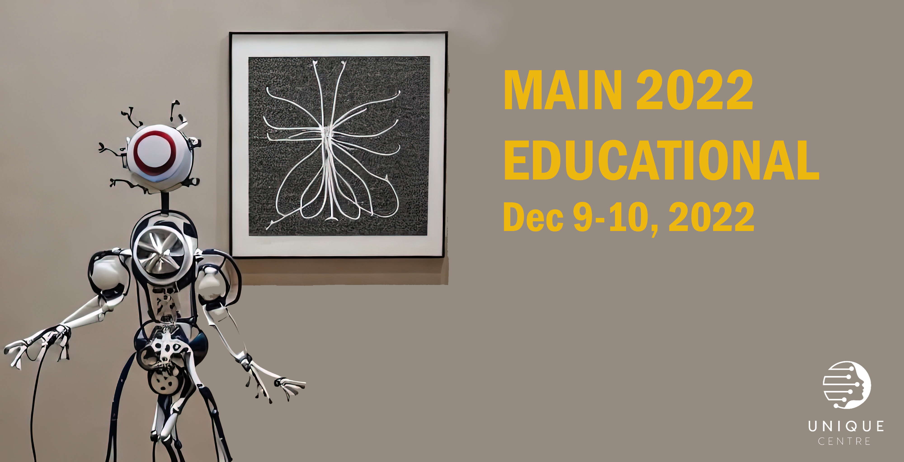

# Welcome

:::{note}
**The event has now passed. You can find the videos and code for all sessions in the material section.**
:::

The NeuroAI educational workshop is organized by Dr. Isil Poyraz Bilgin, CRIUGM, Prof. Pierre Bellec, UdeM, Dr. Elizabeth DupRe, Stanford University, as part of the annual Organization for Human Brain Mapping (OHBM) 2023 [conference](https://www.humanbrainmapping.org/i4a/pages/index.cfm?pageid=4204).

The event is hold as an in-person event, however the pre-recording of the sessions will be accessible via OHBM's online platform. 

Majority of the speakers will present in-person but only one presenter due to the overlap with participating another conference. 

The educational session features both theoretical lectures as well as hands-on tutorials. The hands-on tutorials will be held via online Jupyter Notebook applications to ensure the easiness of following the materials. You will not be required to bring a laptop, but following the demonstration through the screens will be enough to grasp the main aspects of the tutorials. 

The 

 three of them including hands on tutorials to be followed by the audience. The session will be finalized by a panel discussion, where all speakers will join to share their opinions to the premade questions beside 
the questions from the audience. There will be four thematic of the event: 

1. **Technical construction of the brain models**: An introduction of fundamental concepts applicability of AI in the neuroscience research;
2. **Brain decoding and encoding**: Identifying cognitive states based on brain activity (**brain decoding**); and predicting brain activity based on the activity of an artificial neural network (**brain encoding**);
3. **Multimodal overview of NeuroAI**: Implementation of AI in various sensory modality processing including vision, auditory, language.
4. **Ethics and future of NeuroAI**: Ethical concerns and potential future directions in the field.

This event will be held as a full day educational session starting at 8 am EST until 5 pm EST. There will be a lunch break at 12-1 pm EST, and two coffee breaks of 30 min, as one during the morning section and the other will be in the afternoon section of the sessions. 

There will be continous access to water and coffee outside of the event room. 

